# Zack's AI Framework: The Design Choices

A standalone presentation of the decisions behind this AI framework. Every
section follows the same shape: the **force** that pushed on the design, the
**choice** that was made, and the **rationale** — why this and not the
obvious alternative. Sources: grounded in the framework's own files
(`skills/*/SKILL.md`, `agents/*.md`, `reference/*.md`) as of 2026-08-31;
paths are cited so a skeptical reader can check any claim at the source.

---

## 0. What the framework is, in 60 seconds

The framework is a **portable, versioned library of agent skills** — a skill
being a directory containing `SKILL.md` (a numbered checklist a coding agent
follows), `references/` (detail loaded only when needed), `scripts/`
(deterministic harnesses), and `evals/` (test prompts with verifiable
expected behavior). An installer symlinks every skill and agent into the
global agent-harness config, so *any* project on the machine discovers them;
a same-named skill in a project's local config takes precedence.

Around the skills sit **thin agent templates** (`agents/*.md`, 30–100
lines): a role lens, a communication pointer, and a delegation map. They
carry no process knowledge — they defer to the skill that owns each process.

The framework organizes all engineering work into **two feedback loops**,
plus a **meta-loop** that builds the loops themselves, plus an
**orchestrator** that verifies what the meta-loop builds:

| Layer | What it does | Closes on |
| --- | --- | --- |
| **Core engineering loop** | idea → plan → code → tests → verdict | test exit codes |
| **UI iteration loop** | visual + accessibility defects | screenshots + computed CSS + axe results |
| **Meta-loop** (`authoring-skills`) | builds new skills for either loop | validator + evals green |
| **Orchestrator process** | a senior session re-verifies what an author built | independently re-run evidence |

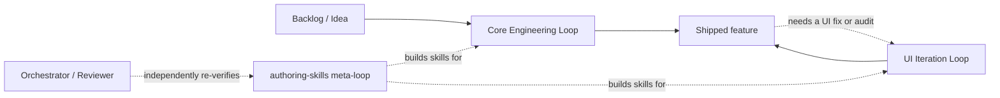

Everything that follows is the reasoning behind that shape.

---

## Choice 1 — Close on objective signals, never on impressions

**Force.** An agent that stops when work "looks done" has verified nothing.
Model self-assessment is the weakest evidence in the system, yet most agent
setups treat it as the final word.

**Decision.** One rule founds the whole framework:

> **Every loop closes on an objective signal — a test exit code, a
> schema-valid report, a computed-CSS delta, an axe result — never on a
> model's impression of its own output.**

This is not applied once at the top; it repeats at every
level of detail where the question "is X done/right?" comes up:

| Level | Question | Objective signal |
| --- | --- | --- |
| Feature | Is it done? | the plan's `## Verification` commands exit 0 |
| Test | Is it meaningful? | break → red → restore → green (the *meaningfulness proof*) |
| UI fix | Was it fixed, harmlessly? | computed-CSS delta achieved **and** every other element byte-identical |
| Accessibility | Is the page compliant? | axe-core scan + manual checklist (automation ceiling stated) |
| Review | Is the diff ready? | mechanical severity table → verdict (the verdict *follows* the table) |
| Model binding | Is this model still right? | independently reproduced benchmarks + live catalog fetch |
| Skill | Does it work? | evals with failable verifiers, run by a fresh agent |

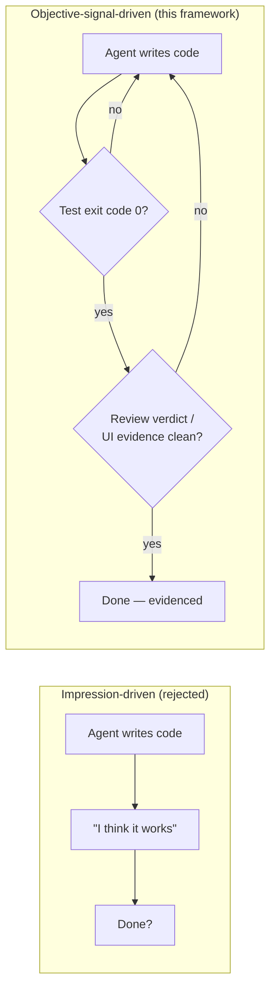

**Rationale.** An objective signal is cheap to produce, cheap to check, and
— the crucial property — **hard to game without leaving a mark**. That last
property is enforced by two sub-decisions:

### 1a. The cardinal rule: never weaken a check to pass it

The most-cited sentence in the framework, defined in
`skills/debugging-test-failures/SKILL.md` and reused by the review,
accessibility-audit, and UI-correction skills:

> **Never green a test by weakening the net** — no `.skip`, no deleted
> assertion, no widened tolerance, no mocking the behavior under test, no
> retry-until-green. An explicit user override is honored only with a
> **dated record**, and the violation stays visible in the report.

A signal that can be silently silenced is not a signal. So every skill that
closes on a check also lists the *only allowed ways* that check may
be marked non-blocking: dated allowlists, dated risk acceptances — never
quiet suppression. Honoring an explicit human override while *recording* it
is the compromise between user authority and audit integrity.

### 1b. Honest negatives: the explicit negative is the closure signal

**Force.** A skipped gate and a passed gate are indistinguishable in a
report that simply omits the step.

**Decision.** Skills must *say* the negative: "no high-value coverage gap
found", "no visible UI", "DEFERRED (no dev server)", "unreachable source —
pass incomplete". Silence is never an answer.

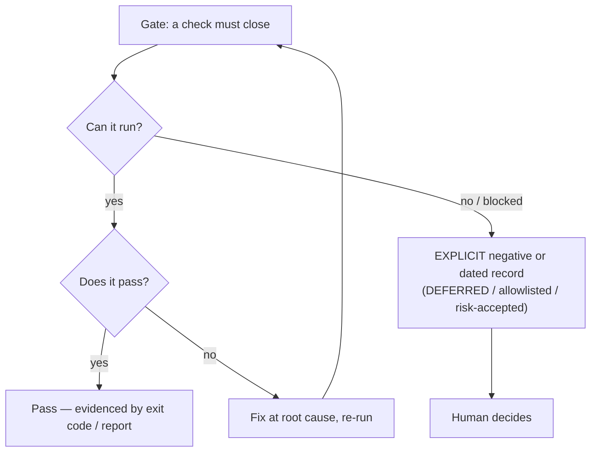

---

## Choice 2 — Bounded autonomy: every skill stops

**Force.** An agent that chains stage after stage on its own initiative
produces work no human can audit — and failures build on each other silently
across stages.

**Decision.** **Every skill ends in a STOP.** Each skill hands off to a
human gate or one *named* sibling skill. `designing-architecture` stops at
user approval of the plan; `implementing-features` stops at a
manual-validation handoff; `reviewing-code` stops at a verdict;
`debugging-test-failures` stops at a root-cause fix or an honest
escalation. Nothing in the framework "keeps going" on its own.

**Rationale.** Autonomy is bounded to one stage at a time so a human can
always answer *who did what, on whose authority*. A second, related decision:
**every skill is read-only or write-only on a narrow surface** —
`triaging-requirements` writes only `ROADMAP.md`; `reviewing-code` writes
only `REVIEW.md` and never edits source; `capturing-ui-evidence` captures
but never diagnoses or fixes. Narrow write surfaces are what make the audit
trail possible to piece back together later, by a human or by another agent
that wasn't there.

The stops are also **cheap to recover from**, which is why the framework
prefers them to guesses everywhere: a stopped handoff costs one prompt; a
confidently built wrong feature costs a rollback. The implement skill
states it as a rule — *stops are recoverable, a built-wrong-feature is
not; when in doubt, stop.*

As confidence in each stage is proven with consistent success, the human gates can be minimized or removed and replaced with a risk analysis and escalation process.

---

## Choice 3 — Skills carry the knowledge; agents are thin bindings

**Force.** Agent harnesses (opencode, Claude Code, and similar) let you
define per-project "agents" with persona prompts and model bindings. The
The obvious move is to write the whole process into each agent — which forks the
process every time you switch harnesses, projects, or models.

**Decision.** A hard separation: **all process knowledge lives in skills**
(portable markdown, harness-agnostic, versioned in one repo); **agents are
thin per-project model bindings** — a role lens in a few lines, a pointer
to the skill that owns the process, and a `model:` line. When the process
improves, one file changes and every project inherits it on `git pull`.
When a project wants a different model, one `model:` line changes and no
process knowledge moves.

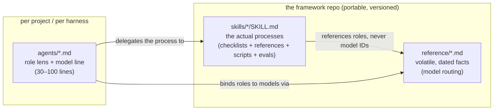

**Rationale.** This is the classic stable-core / changeable-edges split
applied to the harness layer. Two supporting decisions follow from it:

- **Install as a set.** Some skills consume sibling skills' contract files
  (the implement skill reads the design skill's plan-format reference via a
  relative path). The installer links everything, so a consumer project
  never hits a dangling reference — and cherry-picking skills out is a
  flagged, deliberate act.
- **Generic workflows + pluggable stack specifics.** Project- or
  framework-specific detail (Vue+Supabase conventions, GitHub vs Jira
  triage sources, Tailwind vs BEM correction rules) lives in per-skill
  `references/stacks/*.md` files behind a stack-detection step. Adding a
  stack adds a file; it never forks a workflow.

---

## Choice 4 — Behavior-driven stages, with artifacts as contracts

**Force.** Multi-stage agent work usually breaks down into a game of telephone: the
design intent whispered from prompt to prompt, each stage re-interpreting
the last, with no durable record of what was actually decided.

**Decision.** The core loop is **behavior-driven end to end**: every stage
produces a durable *artifact* whose content is observable behavior with a
verifier, and the next stage consumes exactly that artifact — never the
conversation around it.

```
triage → design → implement → verify (unit/integration/e2e) → review → done
  ↑                                                              │
  └──────────────────── failures/gaps route back ────────────────┘
```

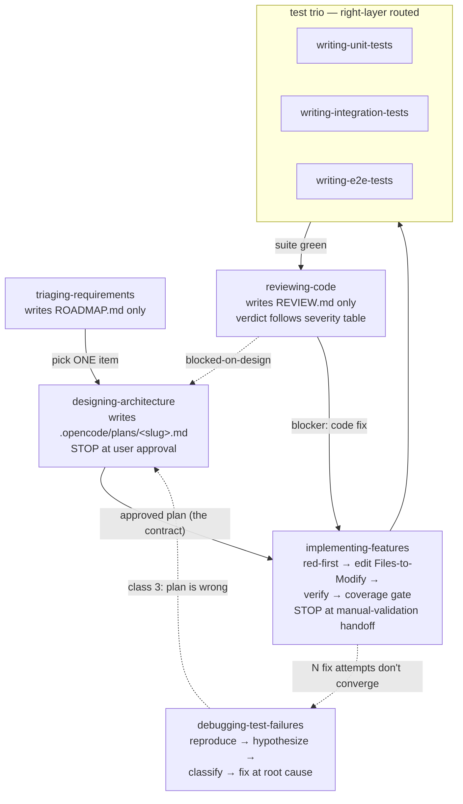

Three decisions make the contract real:

### 4a. Acceptance criteria are behavior + verifier

A plan's acceptance criterion (AC) is not a wish. `designing-architecture`
rejects "the timer works offline" until it carries an **observable behavior
plus a concrete verifier** — a test command, a Playwright selector, a SQL
result. If it can't be observed, it can't be acceptance criteria; it
belongs in Open Questions. The plan also carries a **scope contract** —
`Included` and `Excluded` lists, both required non-empty — which is the
text an implementer cites verbatim when refusing scope creep.

### 4b. Deviation is classified, never improvised

The plan was written in a design pass; the repo may have moved. When plan
meets reality, every mismatch gets an immediate two-way classification:

| Mismatch | Action |
| --- | --- |
| File moved / renamed / import-alias drift | **Mechanical** — proceed at the corrected path, dated `## History` note in the plan |
| Different feature / schema differs / AC untestable as written | **Contract-breaking** — STOP, route back to design |

The dividing question is *does the difference change the feature being
built?* An implementer that silently improvises a different design makes
the audit trail lie — the diff no longer maps one-to-one to the plan, so no
reviewer can separate what was decided from what was improvised. Every
recorded deviation is honest; no silent one is.

### 4c. The verdict is computed, not felt

`reviewing-code` first checks the diff against the plan (every hunk
maps to the plan's `Files to Modify` or a recorded deviation; every AC has
test evidence or an honest `manual` marker), then inspects in strict
priority — correctness → test-net integrity → scope → error handling →
security → style. Findings get mechanical severity
(`blocker/major/minor/nit`), and the verdict *follows the table*: any
blocker → `request-changes`; only minors → `approve-with-nits`; a
plan-internal contradiction → `blocked-on-design`. False-positive
discipline cuts both ways: never manufacture a blocker to seem thorough,
never bury a real one among nits.

---

## Choice 5 — Red-first: capture the behavior before it exists

**Force.** Tests written after the implementation mirror it — they pass
trivially and are not anchored in whether the *intended* behavior was
implemented. Classic TDD solves this for humans; an agent left to "run the
tests" will happily write the tests second and report green.

**Decision.** The implement pass authors **one failing test per testable AC
before any source edit**, and the proof obligation is that the failure is
**for the right reason**: the actual failure output must name the missing
behavior — a `ReferenceError` for a not-yet-written function; an assertion
expecting `409` and observing `200`. Red from a broken fixture or a typo'd
selector is a trap, not a proof; the test's own setup is fixed until the
failure names the intended absence.

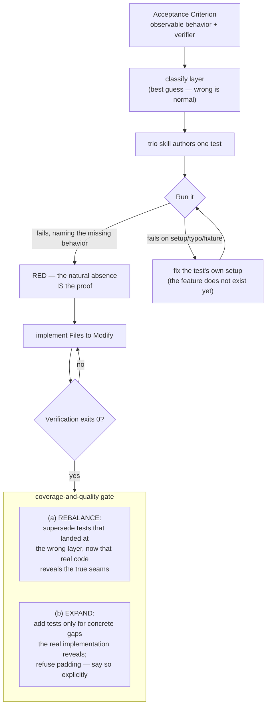

Three supporting decisions complete it:

- **The right-layer routing table.** Which test layer owns a behavior is
  decided by one table, shared verbatim across the three test skills:
  logic computable in isolation → **unit**; two collaborators meeting at a
  seam (store+client, DB+policy) → **integration**; a user journey through
  the real UI → **e2e**. A request never lands at the wrong layer by
  guesswork.
- **Layer guesses are declared guesses.** A plan cannot know true seam
  boundaries before code exists, so the red-first classification is a
  *best guess by design* — wrong guesses are normal, not defects. They are
  corrected at the coverage gate (the *only* place layer-correctness is
  enforced), once real code reveals the seams. The framework asks each
  stage only for what it structurally can know.
- **The meaningfulness proof.** Every test, pre- or post-implementation,
  must demonstrate it can fail: break the guarded behavior on purpose,
  watch red, restore, watch green. *A test never seen red proves nothing.*
  Integration tests must run row-level-security through the authenticated
  client — never a service-role bypass, which would test the bypass, not
  the policy. E2E tests use role/accessible-name/testid selectors and
  condition waits — never `waitForTimeout`, the classic cause of flaky tests.

---

## Choice 6 — Layer by rate of change; isolate the volatile

**Force.** An AI framework's ecosystem churns constantly: model IDs appear
and vanish from catalogs monthly, pricing moves, projects switch stacks.
Most frameworks rot because the volatile facts get baked into the process
text — and the process text is the expensive thing to change.

**Decision.** **Assign every kind of content a layer by how often it
changes, and give each layer its own file home.** Stable disciplines at the
core; volatile facts at the outer edge, isolated and dated; fast-changing
content is never copied into slow-changing files — the slow files only
point to it.

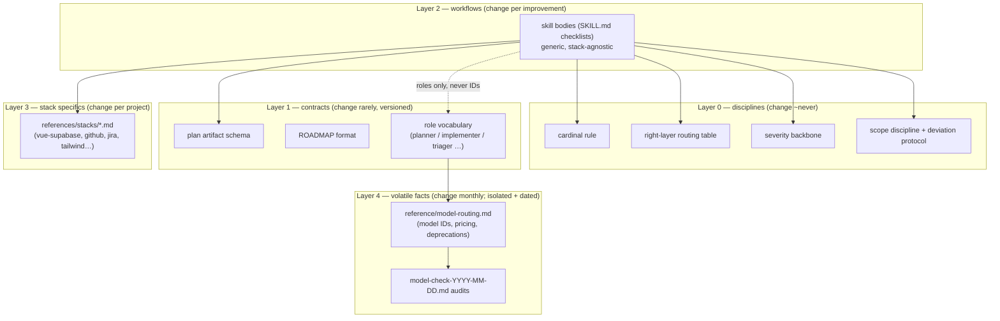

The mechanism that does the real work sits between Layer 1 and Layer 4:
**skills
reference roles, never model IDs.** A skill body says "escalate to the
`planner` role"; `reference/model-routing.md` is the single file in the
framework where a concrete model ID appears. When `ling-3.0-flash-free`
vanished from the provider catalog on 2026-08-14, the fix was a dated
rebind in that one file plus the `model:` lines of the thin agents — zero
skill bodies changed. The alternative — model names baked into twenty
skill files — would have gone silently stale everywhere at once.

Two supporting decisions:

- **Volatile facts are dated, not deleted.** The routing file is a running
  record: every catalog re-check appends a dated `### Routing update`
  section, retired IDs move to a deprecation watch, and replaced claims
  are marked historical rather than rewritten. Any binding's *why* is
  readable, including what it replaced and when.
- **The churn survival test.** This is not theoretical: across catalog
  events on 2026-07-25, 2026-08-02, 2026-08-14, and 2026-08-30 (models
  removed, re-added, deprecated, tier-migrated), the process artifacts —
  skill bodies, plan format, disciplines — needed zero changes. All churn
  landed in the isolated outer layer, each with a dated rationale. The design
  goal is exact: **the most volatile inputs must be the cheapest to
  change.**

---

## Choice 7 — Evidence-graded model selection

**Force.** Model quality claims are the least trustworthy numbers in the
ecosystem: 99 of 100 leaderboard entries self-reported, harness choice
alone swinging scores 10–20 points, and test sets that models may have
already seen in training, where top scores bunch together. Yet model choice
is also the decision that most affects how well everything else works.

**Decision.** Model selection is not a preference; it is a **closed
feedback loop with its own skill** (`optimizing-model-routing`), the same
shape as every other loop in the framework: evidence in, approval gate,
verifiable application, never self-certified.

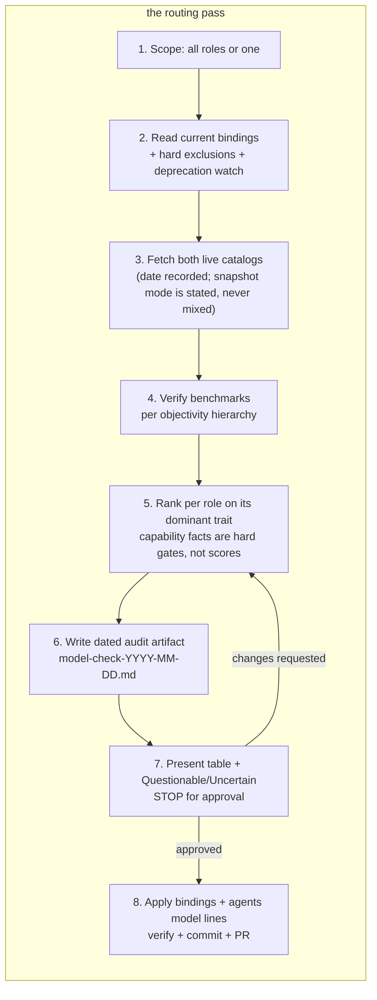

Three rules make the ranking itself objective:

### 7a. The objectivity hierarchy

Every cited score carries source, date, and independence status, and the
hierarchy decides what a number is *allowed* to do:

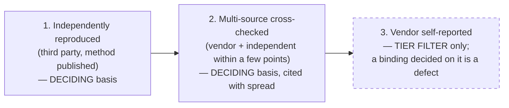

A vendor's own numbers can get a model *onto the ballot*, never *into a
seat*. A binding decided on vendor-only evidence is classified as a defect
in the pass itself.

### 7b. Benchmarks are a tier filter, not a ranking

Harness variance and bunched-together top scores mean a few points of separation is
noise — it is treated as a tie and broken *upward in objectivity*, or on
reliability observations (a model with clean scores but observed streaming
failures under load carries that caveat into the decision). And the
benchmark must measure the role's **actual** work — tool-use benches for
implementers, instruction-following for skill authors, autonomous-loop
benches for planners — never one generic leaderboard for every seat.
Capability facts (native image input for vision seats, catalog membership)
are **hard gates, not scores**: a text-only model cannot hold a vision seat
at any number.

### 7c. Free by default; escalation is an explicit opt-in

The routing table binds every role to a **free model where one exists**,
with a flat-rate tier and a pay-as-you-go frontier tier as *escalation
only* — because defaulting to paid models has direct financial
consequences, and an agent upgrading its own models on its own initiative
is exactly the kind of silent decision this framework refuses everywhere.
The pass also ends honestly: a **mandatory Questionable/Uncertain
section** — vendor-only scores, unbenched newcomers, reliability caveats —
is never omitted, and every entry names what would resolve it. Uncertainty
is surfaced, not quietly folded into a decision.

---

## Choice 8 — In UI work, never let vision guess the rule

**Force.** Vision models are bad at turning a text description of a CSS bug
into the correct fix — and worse, they sound confident while guessing.

**Decision.** Demote vision to **sign-off only**. Build an evidence pipeline
that makes the fix derivable from machine-readable facts: a Playwright +
Chrome DevTools harness captures, for every target selector and viewport, a
screenshot, a chosen subset of the computed CSS, bounding boxes, and — the key
artifact — the **matched-styles map**: *which authored rule at which source
line set each property, and what it overrode*.

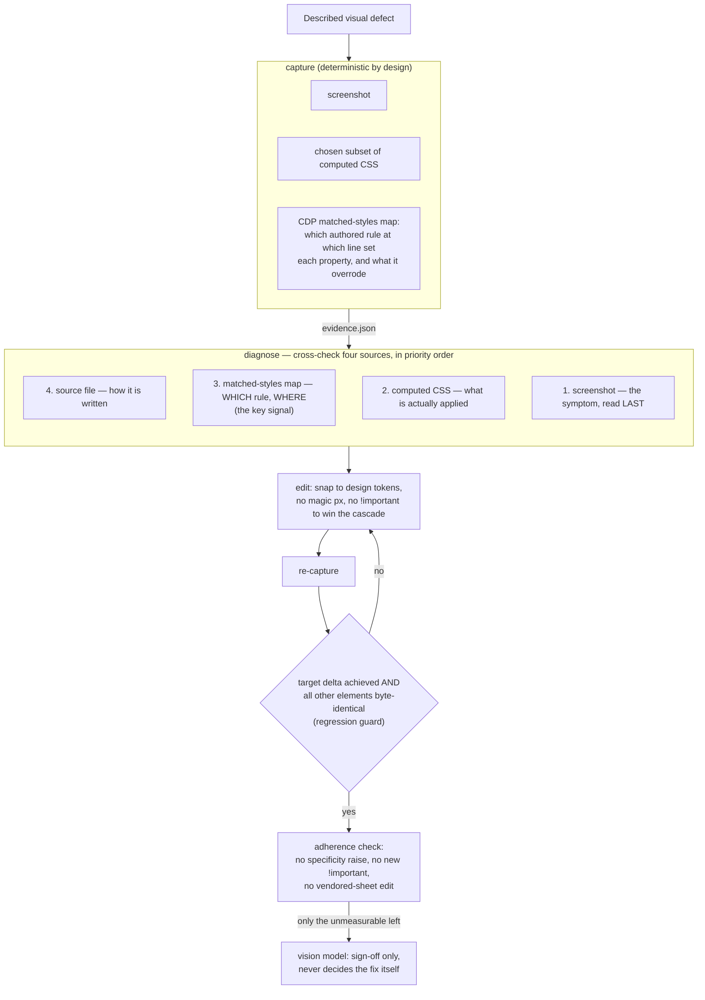

**Rationale, in three parts:**

- **The matched-styles map removes the guess.** Knowing *which selector at
  which source line* won each property — and what it overrode — turns "the
  padding is wrong" from a vision-model guessing game into locating a
  specific rule in a specific file. The fix targets the real cascade
  winner, not the obvious one (a component-library theme override beating
  your own class is the classic case).
- **Determinism is essential.** Animations frozen, condition waits
  (never fixed timeouts), `deviceScaleFactor` pinned — the same input must
  yield the same computed values, or a before/after diff means nothing.
  This is the UI loop's version of a reproducible test.
- **The regression guard is dual.** "Target delta achieved" alone could be
  won by nuking the stylesheet. The second clause — every *other* captured
  element byte-identical — is the full-suite-still-green of CSS. A
  separate adherence check fails on its own axis: no specificity raises,
  no new `!important`, no editing vendored sheets to win the cascade.

The same honesty extends to **proactive accessibility auditing**: an
axe-core harness scans a page and maps each violation mechanically onto
the review severity backbone, routed to the sibling skill that owns the
fix — while stating automation's ceiling: a manual checklist
(keyboard traps, focus order, live regions) is *always* included, even on a
clean pass, because axe automates only ~30–40% of WCAG.

---

## Choice 9 — The library verifies itself the way it verifies work

**Force.** A framework that demands objective evidence from agents but
ships its own processes as trust-me documentation is inconsistent — and
its processes will rot invisibly.

**Decision.** **The skills were built through the same objectivity
discipline they enforce.** Three mechanisms:

### 9a. Evals before the skill body

`authoring-skills` (the meta-skill) drafts **test evals before the skill
exists**: 2–3 realistic prompts with observable expected behavior, and
self-contained fixtures. The rule that does the real work: **verifiers must be able to
fail** — exit non-zero while the work is absent, exit 0 when done. An eval
whose verification cannot fail proves nothing about the skill's feedback
loop. Evals-first also keeps the skill solving real problems instead of
documenting imagined ones.

### 9b. The author never grades itself

Testing happens with a **fresh agent session** that has the skill installed
— only the fresh agent's observable behavior counts, never the author's
memory of what it meant. And before any skill lands, a mechanical validator
(`scripts/validate_skill.py`) enforces the checkable conventions —
frontmatter shape, name rules, description caps, evals with resolvable
fixture paths — so review budget spends on behavior, not formatting. The
context window is treated as a public good throughout: bodies under 500
lines, detail pushed to `references/` loaded only when a step needs it,
every line challenged to justify its token cost.

### 9c. Independent re-verification before commit

Skill authoring is split across sessions on purpose: a mid-tier author
session builds the skill and leaves it **uncommitted**; a separate senior
session independently re-verifies — re-runs the evals from a fresh copy,
tries to break the failable verifier by hand, reads the actual
implementation — before committing.

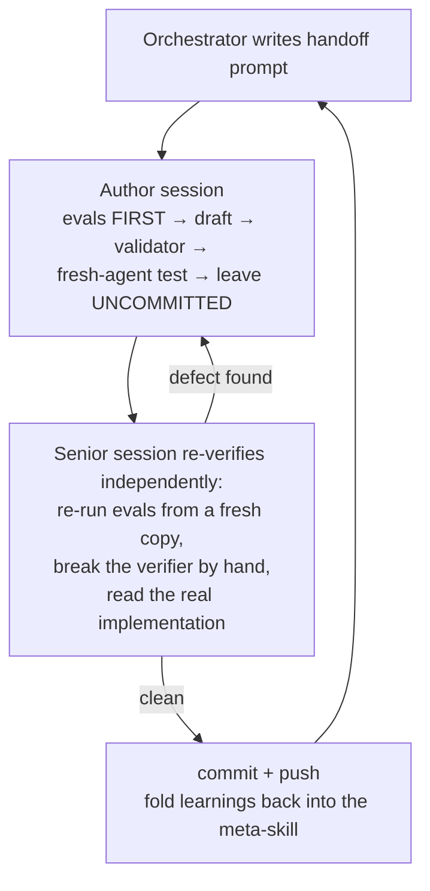

One more decision keeps the whole library coherent as it grows: **disciplines
are defined once and reused by citation, never restated.** The severity
backbone is defined in the review skill and cited by the accessibility
audit; the cardinal rule is defined in the debug skill and cited by three
others; the e2e selector-and-wait doctrine is defined once and reused by
the UI-evidence capture.

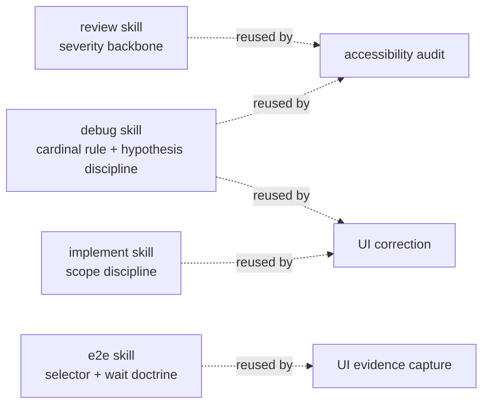

A new skill inherits a rule by citing it — and a cited rule cannot drift
from its original.

---

## Choice 10 — Objectivity through diversity in review

**Force.** A single model reviewing its own work (or a sibling's) inherits
one blind spot set. And the strongest single model is not the strongest
*reviewer* — peak score and independent perspective are different axes.

**Decision.** Multi-perspective analysis runs as a **council**: parallel
subagents, each a narrow lens — security, performance, UX, architecture,
product — synthesized by a chairman into common ground, tensions, a risk
register, and a recommendation. The design bet is stated explicitly:

> **Objectivity comes from family diversity, not raw score.** Mixing model
> families buys independent perspective; a single model reviewing itself
> does not.

The default council mixes three model families (nemotron / mimo /
deepseek) deliberately — even where one family's model scores higher, two
seats on one family would weaken the independence that is the whole point. The
opt-in frontier council mixes Anthropic / Google / OpenAI for the same
reason. And disagreements are **surfaced, never silenced**: a finding one
member overrides is named in the synthesis, not dropped.

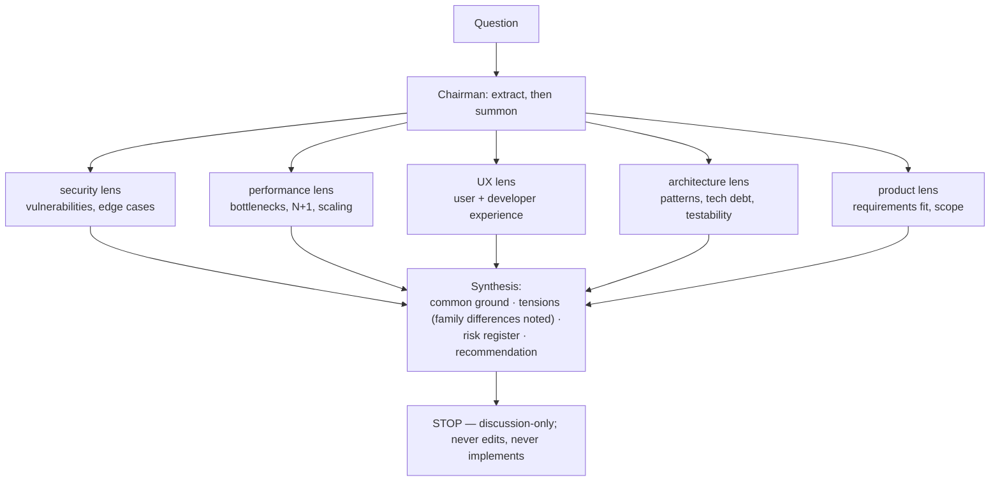

Consistent with Choice 2, the council is **discussion-only** — it never
edits files or writes code. Consistent with Choice 7, it **defaults to
free models**; a paid council is an explicit user opt-in, never an
agent-initiated upgrade.

---

## Choice 11 — Treat communication as part of the signal machinery

**Force.** Agent output is consumed by other agents and by humans under
time pressure. Ambiguity is not a style problem here — a plan whose wording
wobbles produces wrong acceptance criteria downstream; a report padded with
filler buries its verdict; hedged uncertainty ("it seems like…") is
unactionable.

**Decision.** A single communication baseline (`reference/technical-english.md`)
that every agent and skill points to: plain words and the shared vocabulary
(`plan artifact`, `AC`, `handoff`, `red-first` — used verbatim, never
re-described with fresh phrasing, so a term means one thing everywhere); no
filler; exact numbers over approximations; **uncertainty stated with
labels** (`unverified`, `vendor-stated`, `assumed`) rather than hedges; and
a fixed handoff shape — *done → verified → blocked → next*.

**Rationale.** This is the same bet as Choice 1, applied to language: an
output that is plain, parseable, and labeled is a signal; a vibes-based one
is an impression. The baseline is deliberately a floor, not a style manual
— ordinary conversation is exempt from the word-blacklist; engineering
artifacts are not. Violations are handled the same way as anything else
that drifts in this framework: point at the specific rule, self-correct, don't
restyle wholesale.

---

## The choices, summarized

| # | Choice | Force it answers | Mechanism | What it buys |
| --- | --- | --- | --- | --- |
| 1 | Close on objective signals | "looks done" verifies nothing | exit codes, reports, deltas as closure; cardinal rule; honest negatives | completion that can't be faked |
| 2 | Bounded autonomy | chained stages can't be audited | every skill STOPs; narrow write surfaces | a readable record of who did what |
| 3 | Skills carry knowledge, agents are thin | process forks per harness/project/model | one versioned skill library + thin `model:` bindings | process improves once, inherited everywhere |
| 4 | Artifacts as contracts | intent lost between stages | AC = behavior + verifier; deviation protocol; computed verdicts | intent survives the pipeline |
| 5 | Red-first | test-after mirrors the code | fail-for-the-right-reason before implementation; rebalance/expand gate | tests that specify, not describe |
| 6 | Layer by rate of change | volatile facts rot the process | roles-not-IDs; dated isolation layer; pluggable stacks | monthly churn costs one file |
| 7 | Evidence-graded model selection | benchmark numbers are the least trustworthy input | objectivity hierarchy; tier filters; per-role dominant trait; approval gate | bindings that cite their evidence |
| 8 | Never let vision guess the rule | vision models guess confidently | matched-styles map; determinism; dual regression guard | UI fixes grounded in facts |
| 9 | The library verifies itself | trust-me documentation rots | evals-before-body; fresh-agent testing; independent re-verification | the framework's credibility is earned, not asserted |
| 10 | Diversity as objectivity | one model, one blind spot set | multi-family council; surfaced disagreements | independent perspective by design |
| 11 | Communication as signal machinery | ambiguity spreads downstream | shared vocabulary; labeled uncertainty; fixed handoff shape | parseable, actionable output |

One-line summary of the whole design: **a stable process core that closes
only on objective evidence, with every volatile input — models, stacks,
projects — routed through a dated, isolated, approval-gated outer layer.**
