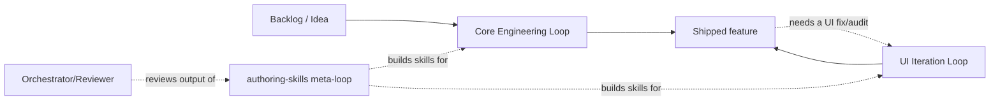
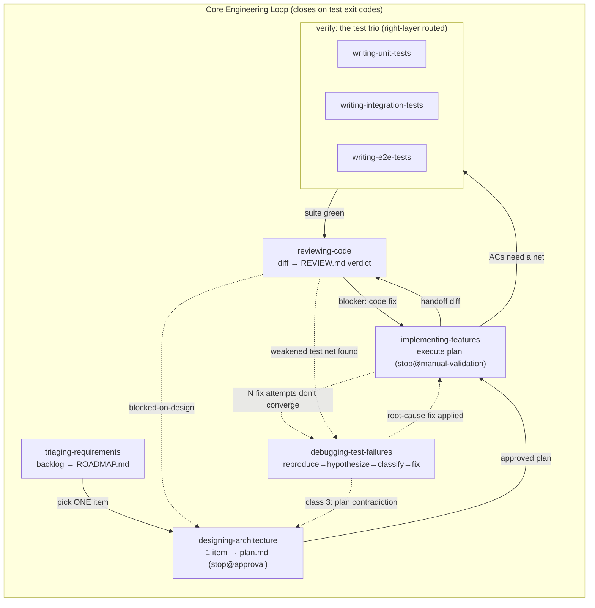
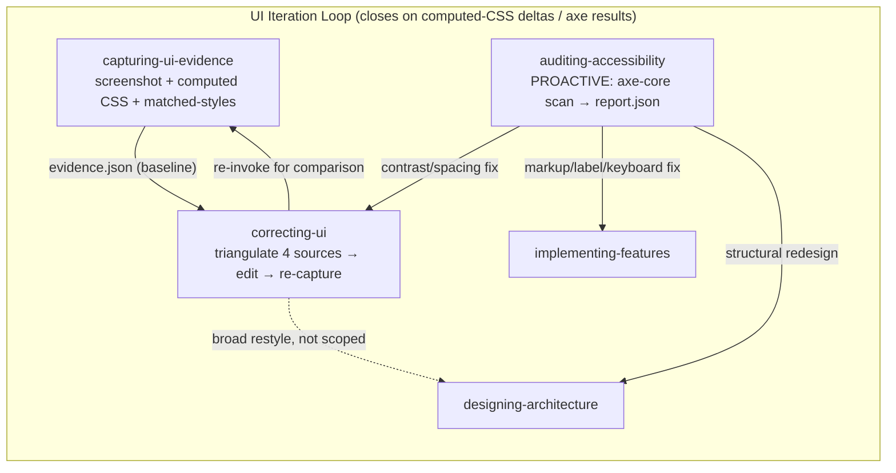
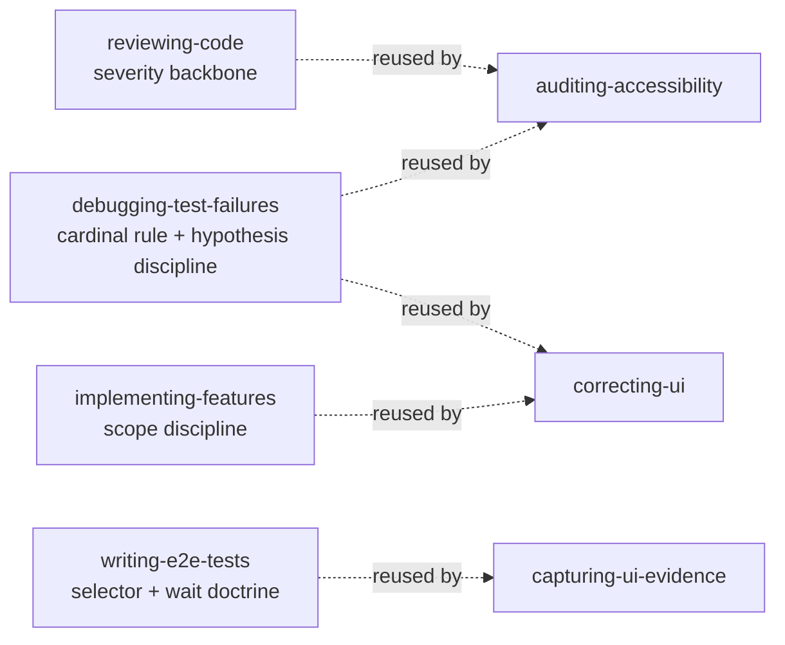
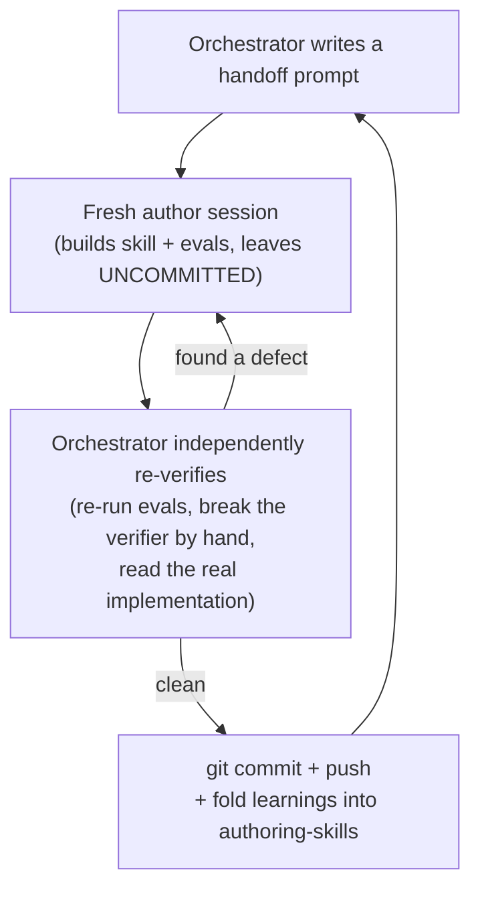

# Curriculum: The ai-framework Skill Loops

> Grounded directly in the `SKILL.md` files in this repo.
> Fourteen lessons, high level → deep. Work top to bottom; each module builds
> on the last.

---

## Module 0 — Orientation (the 30,000ft view)

This repo is a **portable library of agent skills** (`skills/<name>/SKILL.md`
+ `references/` + `scripts/` + `evals/`) installed globally so any project
can use them. It exists to solve one problem: **an agent's success shouldn't
depend on "looks done" — it should close on an objective signal** (a test
exit code, a schema-valid report, a computed-CSS delta).

There are exactly **two feedback loops**, plus a **meta-loop** that builds
the loops themselves, plus an **orchestrator process** that reviews what
gets built:

| Layer | What it does | Closes on |
|---|---|---|
| **Core Engineering Loop** | Ships a feature: idea → plan → code → tests → verdict | test exit codes |
| **UI Iteration Loop** | Fixes/audits visual + accessibility defects | screenshots + computed CSS + axe results |
| **Meta-loop** (`authoring-skills`) | Builds new skills for either loop | validator + evals green |
| **Orchestrator process** | A senior session reviews what a mid-tier author built | independently re-run evidence |



Every skill in the library shares the same shape: a numbered **checklist**,
a **stack-detection step** (project specifics live in
`references/stacks/*.md`, never in the workflow body), an **objective
closure condition**, and a **STOP** — every skill hands off to a human or a
sibling rather than chaining automatically. Nothing in this library "keeps
going" on its own; that's deliberate.

---

## Module 1 — The Core Engineering Loop, in one paragraph

```
triage → design → implement → verify(unit/integration/e2e) → review → done
  ↑                                                              │
  └──────────────────── failures/gaps route back ────────────────┘
```

Seven skills, each owned by exactly one stage, each **read-only or
write-only on a narrow surface** so a human reviewer can always tell who
did what:

| Skill | Reads | Writes | Stops at |
|---|---|---|---|
| `triaging-requirements` | backlog (text/files/Jira/GitHub) | `ROADMAP.md` | a fully-resolved roadmap |
| `designing-architecture` | one roadmap item | `<plans_dir>/<slug>.md` | user approval |
| `implementing-features` | one approved plan | source files in `Files to Modify` | a manual-validation handoff |
| `validating-ui` | a changed flow (in-loop, Step 8) | `.opencode/evidence/<plan-slug>/` only | net verdict + UX review findings |
| `writing-unit-tests` / `-integration-tests` / `-e2e-tests` | plan ACs or an untested behavior | new test/spec files | full suite green |
| `debugging-test-failures` | a failing command | a root-cause fix | full suite green, or an honest escalation |
| `reviewing-code` | a diff + the plan | `REVIEW.md` only | a verdict |

Now the deep dive on each.

### 1.1 `triaging-requirements` — turn a mess into a roadmap

**Trigger:** "triage these", "sort this backlog", "what should we work on
first" — anything that's *many* items.

Pulls items from pasted text, local files, and live trackers (Jira/GitHub
via stack references), dedupes, categorizes into exactly one of
`feature | bug | debt | chore` (or `review` if genuinely ambiguous), scores
by **impact × urgency** (or a user-supplied rubric like RICE), and
**merges** into `ROADMAP.md` — never regenerates it. Closure is strict:
every item from every *reachable* source is added, merged, or explicitly
`skipped` with a reason. An unreachable source (auth missing, tracker down)
keeps the pass honestly **incomplete**, not silently closed.

Key discipline: a rubric change is the *only* thing that triggers
re-scoring already-ranked items; everything else is append-only so
priorities stay comparable across sessions.

### 1.2 `designing-architecture` — turn one item into a verifiable plan

**Trigger:** "plan this feature", "how should we build item N" — always
**one** item; a pile of items routes back to triage.

Researches the actual codebase (reads the files it names — never guesses a
path), then extracts three things:
1. **Goal** — one sentence, user-facing outcome.
2. **Acceptance Criteria** — each one an *observable behavior + a concrete
   verifier* (a test command, a Playwright selector, a SQL result). "The
   timer works offline" is rejected until it has a verifier.
3. **Boundaries** — `Included` / `Excluded`, both non-empty, so a future
   implementer can cite the Excluded list to refuse scope creep.

The plan is written to `.opencode/plans/<slug>.md` (or the project's
configured path) and the skill **stops at approval** — it never
implements. It distinguishes two kinds of ambiguity:
- **Feature-identity ambiguity** ("share a timer" could mean read-only
  link, co-control, or export — three different feature sets) → **ask,
  don't guess**.
- **Design-decision ambiguity** (invite method, admin model — same
  feature, different defaults) → **draft with defaults**, recorded in
  `## Open Questions`.

### 1.3 `implementing-features` — execute exactly one plan

**Trigger:** "implement the plan", "build feat-x", "the plan is approved,
go."

This is the **consumer** of the plan artifact — the whole loop's audit
trail depends on this contract holding. Reads the plan's `status:`
(refuses to implement a `draft`), reconciles the plan against the *actual*
repo (a moved file is a **mechanical deviation** you note in `##
History`; a different feature/schema is a **contract-breaking deviation**
— STOP, route back to design), then edits **only** `Files to Modify`, runs
the plan's own `## Verification` commands until they all exit 0, validates
the changed flow's runtime UI in-loop (Step 8 — `validating-ui`: console
errors/warnings/pageerrors block unless allowlisted, UX-subagent review,
bounded fix loop), passes the coverage-and-quality gate (Step 9 —
rebalance + expand), appends a `## History` entry, and stops at a
**manual-validation handoff** — it never self-certifies a criterion that
needs human eyes.

Scope discipline is the heart of this skill: three named pressures (a
"helpful" user extra, "ugly" neighboring code, an "incomplete" plan) all
get the same answer — refuse, cite the plan, record a follow-up, don't
build it. Two honest-stop conditions hand off elsewhere: N fix attempts
don't converge → `debugging-test-failures`; the plan itself is wrong →
`designing-architecture`.

> **Known gap (flagged 2026-07-11):** this skill does not currently
> mandate a TDD sequence. The plan's `## Verification` section is defined
> as generic gate commands (`npm run test`, `npm run e2e`, etc. — see
> `designing-architecture/references/plan-format.md`), and Step 6 just
> runs them and fixes code on failure — it does not require writing a
> failing test per acceptance criterion *before* implementation. Test
> authoring is split into three separate skills
> (`writing-unit-tests`/`-integration-tests`/`-e2e-tests`) that are
> explicitly "invoked separately by the user," with no enforced order
> relative to `implementing-features`. `reviewing-code` Step 4.2 does
> check tests are meaningful/could-fail-red/right-layer/additive, but only
> as a **post-hoc audit of an already-written diff**, not a built-in
> red-first → green → coverage-expansion pass inside the implement loop.
> This is a real architecture gap against classic TDD — see the session
> note at the bottom of this document for the proposed next step.

### 1.4 The test trio — `writing-unit-tests` / `writing-integration-tests` / `writing-e2e-tests`

Three siblings that share one job (turn an acceptance criterion into a
test that can actually fail) and one **right-layer routing table**, so a
request never lands at the wrong layer:

| Behavior only observable when… | Right layer |
|---|---|
| Logic computable in isolation (pure function, store action, composable) | **unit** |
| Two collaborators meet at a seam (store+client, DB+policy, outbox+replay) | **integration** |
| A user journeys through the real UI | **e2e** |

Every one of the three enforces the same non-negotiable: the
**meaningfulness proof** — after writing a test, break the guarded
behavior on purpose, watch it go **RED**, restore, watch it go **GREEN**.
*"A test never seen red proves nothing."* Integration tests additionally
require RLS/isolation checks to run through the **authenticated client**,
never a service-role bypass (that would test the bypass, not the policy).
E2E tests require role/accessible-name/testid selectors (never bare CSS)
and condition waits (never `waitForTimeout` — the canonical flake).

### 1.5 `debugging-test-failures` — the diagnosis discipline

**Trigger:** "this test is failing and I can't tell why", or the handoff
from `implementing-features` Step 6 non-convergence.

This is the most procedural skill in the loop:

```
reproduce → hypothesis → discriminating experiment → classify → fix → full-suite regression guard → closure
```

**Step 5 is the heart of it** — the defect is in exactly one of four
classes, and misclassifying is how a debug pass turns into a trap:

1. **THE CODE** — fix it, minimal diff, at the root cause (not the
   symptom).
2. **THE TEST** — legitimate only with an explicit citation from the
   spec/plan; the fixed assertion must still be able to go red.
3. **THE DESIGN/PLAN** — the test is right, the code matches the plan,
   and they *still* conflict → **STOP**, route to `designing-architecture`.
   Never silently pick a side.
4. **THE ENVIRONMENT** — fix the *source* of nondeterminism (deterministic
   waits, seeded data, isolated state), never wrap it in retries.

**The cardinal rule**, which every other skill in the library cites:
**never green a test by weakening the net** — no `.skip`, no deleted
assertion, no widened tolerance, no mock-the-behavior-under-test, no
retry-until-green. An explicit user override is honored only with a
**dated record**.

### 1.6 `reviewing-code` — the verdict discipline

**Trigger:** "review this", "is this ready to merge", or the natural
handoff after implement.

Read-only on the code. Resolves a real diff (never reviews from prose),
and when a plan is in play runs a **plan-conformance sweep first**: every
hunk maps to `Files to Modify` or a recorded deviation; every AC has
evidence (a test, or an honest `manual` marker). Then inspects the diff in
strict priority order — **correctness → test-net integrity → scope →
error handling → security → style** (never lead with nits). Findings get
a mechanical severity (`blocker/major/minor/nit`), and the verdict
*follows* the severity table, never a separate vibe:

- any blocker → `request-changes`
- only minors/nits → `approve-with-nits`
- a plan-internal contradiction → `blocked-on-design` (same class-3
  posture as the debugger)

Output is always `REVIEW.md` at the repo root. **False-positive
discipline cuts both ways**: never manufacture a blocker to seem
thorough, and never bury a real one among nits.

### The Core Loop, as a skill chain



---

## Module 2 — The UI Iteration Loop

```
intent → capture baseline → triangulate → edit → re-capture → objective delta → perceptual sign-off
              ↑                                                        │
              └────────────────────── not converged ───────────────────┘
```

This loop exists because **vision models are bad at turning a text
description of a CSS bug into the correct fix.** The architecture's
answer: never let vision guess the rule. Three skills:

### 2.1 `capturing-ui-evidence` — the "reproduce" step, made machine-readable

**Never diagnoses, never fixes.** Runs a bundled Playwright + CDP harness
(`scripts/capture.mjs`) against a dev-server route (app mode, with an
auth-fixture session) or an isolated component harness (component mode,
over `file://`). For every (selector × viewport) it writes: a screenshot,
a **curated** computed-CSS profile (not all ~300 longhands — a documented
subset), a bounding box, and the key artifact — the **CDP matched-styles
map**: *which authored rule at which source line set each property, and
what it overrode*. This is what removes guessing from the next skill.

Determinism is load-bearing: animations frozen, waits on conditions
(`networkidle`, `fonts.ready`) never fixed timeouts, `deviceScaleFactor: 1`
pinned — the same input always yields the same computed values, or a
before/after diff means nothing.

### 2.2 `correcting-ui` — diagnose and fix, vision last

**Triangulates four sources** to a root-cause hypothesis, in priority
order:
1. the screenshot (*what looks wrong* — the symptom, read last)
2. the computed CSS (*what's actually applied*)
3. **the matched-styles map** (*which rule, where* — the load-bearing
   signal; if the winner is a *different* selector than the obvious one,
   e.g. a Vuetify `.v-theme--light .x` override, that's the real fix
   target)
4. the source file (*how it's written*)

Fixes **snap to tokens** (a design token > an existing SCSS variable > a
new well-named one — never a magic px), then re-captures and runs a
bundled comparator that must pass **both**: the target delta was
achieved, *and* every other captured element's box/computed CSS is
byte-identical (the regression guard — UI-loop's version of "full suite
still green"). A separate **adherence checker** is failable on its own
axis: no specificity raise, no new `!important`, no vendored-sheet edit.
Only the genuinely perceptual residue — what has no measurable target —
goes to a vision-critic role, and only for sign-off, never to re-derive
the fix.

A trivial correction needs no plan; a broad restyle routes to
`designing-architecture` first.

### 2.3 `auditing-accessibility` — the proactive third skill

Unlike the other two (reactive — triggered by a described problem), this
one is **proactive**: given a page/route/component, it *finds* WCAG
violations without being told where to look, using a bundled Playwright +
axe-core harness (`scripts/audit.mjs`). Every violation gets severity
(mapped mechanically from axe impact: `critical→blocker, serious→major,
moderate→minor, minor→nit` — the same backbone `reviewing-code` uses), a
WCAG success criterion, a fix pointer, and a **route** to the sibling that
owns the fix (contrast → `correcting-ui`; markup/label/keyboard →
`implementing-features`; a redesign → `designing-architecture`). It is
**read-only** — reports and stops.

Two disciplines carried in from the core loop: the **cardinal rule**
(never green an audit by suppressing a rule — an explicit risk acceptance
is recorded dated, and the violation *stays in the report*, still
counted) and honesty about **automation's ceiling** (axe automates
~30-40% of WCAG; a `manual_checklist` — keyboard traps, focus order, live
regions — is *always* emitted, even on a clean `pass`).

### The UI Loop, as a skill chain



---

## Module 3 — Where the two loops meet

They are not fully separate: `capturing-ui-evidence` reuses
`writing-e2e-tests`' selector doctrine (role/accessible-name/testid) and
its real-browser-deferral pattern; `correcting-ui` and
`auditing-accessibility` both reuse `reviewing-code`'s severity backbone
and `debugging-test-failures`' cardinal rule (never weaken a check to make
it pass). This is deliberate — **one durable discipline, reused everywhere
it applies**, rather than reinvented per skill.



---

## Module 4 — The loop that builds the loops

### 4.1 `authoring-skills` — the meta-skill

Every skill above was built *through* this one. Its own loop: capture
intent → interview → **draft evals before the skill body** (eval-driven,
per Anthropic's methodology) → draft → self-review against a checklist →
test with a fresh agent → iterate → finalize. It bundles
`scripts/validate_skill.py`, which every skill (including itself) must
pass: frontmatter/name regex, description length caps, evals present with
resolvable fixture paths, TOC on long references.

### 4.2 The orchestrator/reviewer process

This isn't a skill — it's a documented **human+senior-session workflow**
(captured in `skills/authoring-skills/SKILL.md` Library conventions and
`skills/reviewing-code/SKILL.md`): a mid-tier author session builds a skill
and leaves it *uncommitted*; a separate high-tier session independently
re-verifies it (never trusting the author's report — re-run the evals
from a fresh copy, try to break the failable verifier by hand, read the
actual implementation code) before committing and pushing.



---

## Module 5 — Roles, not model IDs

Every skill body says things like "escalate to the `planner` role" —
never a model name. All bindings live in one dated file,
`reference/model-routing.md`:

| Role | Used by | Go default | Zen escalation |
|---|---|---|---|
| `planner` | designing-architecture | glm-5.3 (alt glm-5.2) | claude-opus-5 |
| `implementer` | implementing-features | kimi-k2.7-code | claude-sonnet-5 |
| `test-writer` | the test trio | kimi-k2.7-code | claude-sonnet-5 |
| `debugger` | debugging-test-failures | glm-5.3 | claude-sonnet-5 |
| `reviewer` | reviewing-code | glm-5.3 | claude-sonnet-5 |
| `vision-critic-fast/-final` | UI loop | minimax-m3 / — | gemini-3-flash / gemini-3.1-pro |
| `skill-author` | authoring-skills | minimax-m3 (glm-5.2 escalation) | qwen3.7-max |
| `skill-reviewer` | the orchestrator process | — | claude-opus-5 |

This is *why* GLM 5.2 built `auditing-accessibility`: it's the documented
`skill-author` escalation tier for greenfield-ish, contract-consuming
skills.

---

## Suggested learning order

1. Read one skill's `SKILL.md` top to bottom — pick
   `debugging-test-failures`, it's the most self-contained and has the
   clearest closure logic.
2. Trace one plan through the whole core loop by reading
   `designing-architecture/references/plan-format.md` and then
   `implementing-features/SKILL.md` Steps 4–7 side by side — see the
   contract.
3. Read `capturing-ui-evidence` then `correcting-ui` back to back — the
   matched-styles map is the single cleverest idea in the library.
4. Read `skills/authoring-skills/SKILL.md` (Library conventions)
   in full to see how the meta-loop and the two working loops fit together.
5. Skim `reference/model-routing.md` last — it's the one file expected to
   go stale, by design.

---

## Session note (2026-07-11): the TDD gap

Raised in review: `implementing-features` does not currently sequence a
TDD discipline (red tests from the plan's ACs first, implement to green,
then a coverage-expansion pass per the testing pyramid). Confirmed against
the source:

- The plan's `## Verification` section (`designing-architecture/
  references/plan-format.md`) is generic gate commands, not a per-AC
  red-test mandate.
- `implementing-features` Step 6 fixes code until existing verification
  commands exit 0; it does not require a failing test to exist first.
- The test trio (`writing-unit-tests`/`-integration-tests`/`-e2e-tests`)
  is explicitly invoked separately by the user, with no enforced order
  relative to implementation.
- `reviewing-code` Step 4.2 checks tests are meaningful/right-layer/
  additive, but only as a post-hoc audit of an already-written diff.

This is a real gap against classic TDD. Fixing it touches the contract
between `designing-architecture`, `implementing-features`, and all three
test-trio skills, so it's architecture-level work (per this library's own
scope test).

**Update (2026-07-11): designed and locked.** The TDD-aware implement
sequencing decisions (red-first step + coverage-and-quality gate) are
captured in `skills/implementing-features/SKILL.md`. Shape: `implementing-features` gains a **red-first step** (one
test per testable AC, authored and run *before* any source edit, at a
**best-guess** layer — proven right by a natural pre-implementation
failure that must be confirmed to fail *for the right reason*, not a
broken test harness) and a **coverage-and-quality gate** near the end
(two jobs: **rebalance** any AC-test that landed at the wrong layer now
that the real implementation reveals the true seam boundaries — this is
the testing-pyramid correction, and it is deliberately the *only* place
layer-correctness is enforced, never at design time — and **expand**
coverage only where the real implementation reveals a genuine gap, never
as padding). `plan-format.md` is explicitly left unchanged, permanently —
a plan cannot know true seam boundaries before code exists, so demanding
precise per-AC layer tags at design time would be asking it to know
something it structurally cannot yet know.
